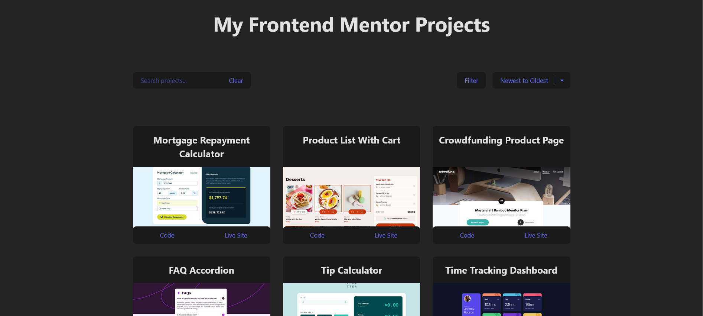

# My Frontend Mentor Projects

This is a website displaying all of my [Frontend Mentor](https://www.frontendmentor.io/) projects.



## Built with

- [Vite](https://vite.dev/) - frontend build tool
- [React](https://react.dev/) - JavaScript library

## Installation and Setup

- Install [Node.js](https://nodejs.org) on your system.

- Open the directory inside the terminal and run the following command to start the development server:

```bash
npm run dev
```

## User Guide

Each project has two buttons:

- Select 'Code' to view the github repo.
- Select 'Live Site' to go the live website.

You can search for specific project using the search bar. Projects can also be filtered using the "filter" button or sorted using the dropdown menu beside the "filter" button.

## Credits

Author: [Josh](https://github.com/josh76543210)
